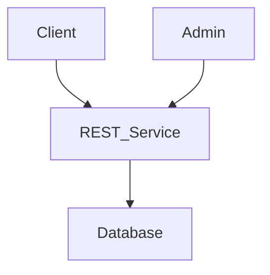
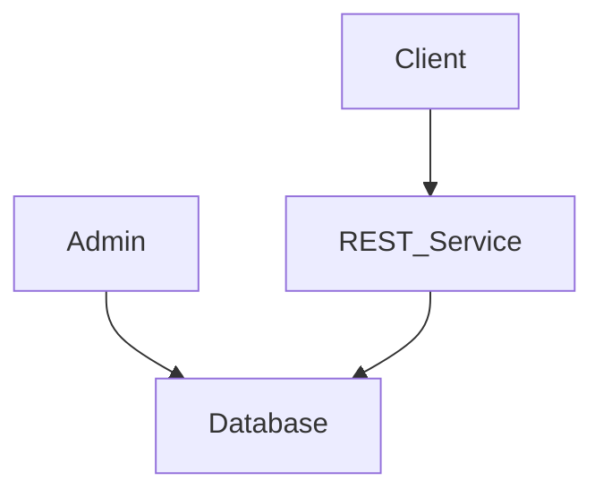

# Project planning

## Challenges

- unreliable power
- computer scarcity (but proliferated cellphone ownership)
- datacenters not in Africa
  - latency
  - flaky network router peering
- latency could cause update problems
- minimal standup, maintenance cost

## Questions

- Browser stats of teachers?
- How best to ensure reliable accounting?
  - unique database feature(s)
  - batching and queuing
  - [ACID](https://en.wikipedia.org/wiki/ACID) vs [BASE](https://en.wikipedia.org/wiki/Eventual_consistency)
- School system composition [MCSS Schools](https://mcssliberia.org/schools/)
  - Are there school districts?
- Do teachers:
  - Share classrooms?
  - Specialize(do kids change classrooms for different classes?) or generalize(teach same students all day)?
  - Do most teachers have mobile phones? 
  - Teach multiple groups of children ? (A day, B day)
- Is attendance for just classes or should it include exams?
- Should attendance entry for particular classes be limited to a time-frame? (i.e. Teacher has 24 hours from time lesson occurs to enter attendance data. I figure this would prevent sham data proliferating and encourage same-day attendance taking)
- Do teachers have a process to manually take attendnace currently? If not, how do we make it easy for them to remember to enter attendance data (e.g. push notifications)?

## Required Functionality
- Can query for Attendance statistics based on school, district, (etc.)?
  --> Maintain DB with student attendance data

## End Users
- Admins (school administrator(s))?
- Teachers

## Architectural attributes

- open source
- robust stack

### Authentication

-JWT token-based authentication? https://jwt.io/introduction

### Frontend

- Separate admin/analyst interface
- mobile first
- cache-able front-end (pwa) -- https://web.dev/learn/pwa/architecture/
- Multipage Application
- Server Side Rendering  
  - ~~GraphQL~~: Too complex and back end can limit data transfer with routes

### Backend

- lightweight API call-based
- time series data (why this important..? I mean, we can generate all sorts of useful metrics without it?)
- RESTFUL pattern
- Hosting provider? (link to German one?)

## Technologies (ideation)

### Frontend framework options

- [Preact](https://preactjs.com/)
- [Vue](https://vuejs.org/)
- [Mithril](https://mithril.js.org/)
- [SolidJS](https://www.solidjs.com/)
- [Svelte](https://svelte.dev/)
- [Lit](https://lit.dev/docs/)
- 
- Written off
  - ~~React~~: Size
  - ~~Angular~~: Size
  - ~~Ember~~: Size
  - ~~Astro~~: [Their docs says that it's not good for apps](https://docs.astro.build/en/concepts/why-astro/#content-focused)

### Admin interface

*Needs discussed.*

- Build our own or incorporate existing?
- Direct access to database or use REST endpoints?

*or*

### Backend options

Least constraints here- it will serve as an API endpoint for clients and admin interface

- [Flask](https://flask.palletsprojects.com/en/2.2.x/#)
- [Django](https://www.djangoproject.com/)
- [FastAPI](https://fastapi.tiangolo.com/)

### Database options

#### General relational databases

- MySQL
- PostgreSQL
- MariaDB

#### Time series databases (is this necessary?)

- [InfluxDB](https://www.influxdata.com/influxdb-pricing/)
- [TimescaleDB](https://www.timescale.com/) (built on top of PostgreSQL)
- [AWS Timestream](https://aws.amazon.com/timestream/)
- [OpenTSDB](http://opentsdb.net/)

## Working definitions

- School: A building or group of buildings considered a single institutional entity
- Classroom: single room at a school where groups of students and teachers participate in class sessions (poorly worded)
- Teacher: Person who teaches and takes attendance
- Student: Person who attends classes and receives lessons
- Subject: A lesson plan that us used to teach a class (does this matter for attendance keeping purposes?)
- Course: A schedule of lessons covering a subject given by a specific teacher to a prescribed group of students
- Lesson: A single scheduled session of a course

## Data model

 *not started- dependent on answers to open questions above*

- Schools
- Classrooms
- Teachers
- Students
- Subjects (Is this relevant for attendance purposes?)
- Classes (recommend renaming to "Courses")
- Lessons

## Resources for data modeling
https://nces.ed.gov/pubs2017/NFES2017007.pdf

• **Attendance Status**: Attendance status is defined as the status of a person’s attendance associated with an
Attendance Event Type, Calendar Event Date in an organization-person-role context.10 Attendance status
options include
▫ present;
▫ excused absence;
▫ unexcused absence;
▫ tardy; and
▫ early departure.
• **Number of Days in Attendance**: The number of days a person is present when school is in session during
a given reporting period.11 This applies to an enrollment period record. Separate records using this element
definition could capture attendance for regular enrollment, an out-of-school program or other program
requiring attendance records.
• **Student Attendance Rate**: The number of school days during the regular school year (plus summer, if
applicable, if part of implementing the restart, transformation, or turnaround model)12 the student attended
school divided by the maximum number of days the student could have attended school during the regular
school year.13
• Attendance Event Date: The date on which an attendance event takes place.14
• Attendance Event Type: The type of attendance event.15 Attendance event type options include
▫ daily attendance;
▫ class/section attendance;
▫ program attendance; and
▫ extracurricular attendance.

## References

- [Monrovia Consolidated School System (MCSS)](https://mcssliberia.org/)
- [SIS-MCSS GitHub repo](https://github.com/code4nova/SIS-MCSS)
- [How to Make PWAs Installable](https://developer.mozilla.org/en-US/docs/Web/Progressive_web_apps/Installable_PWAs)
- [Learn PWA](https://web.dev/learn/pwa/)
- [PWA Minimus: A minimal PWA checklist](https://mobiforge.com/design-development/pwa-minimus-a-minimal-pwa-checklist)
